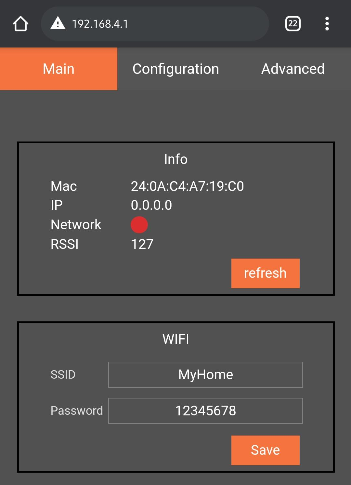
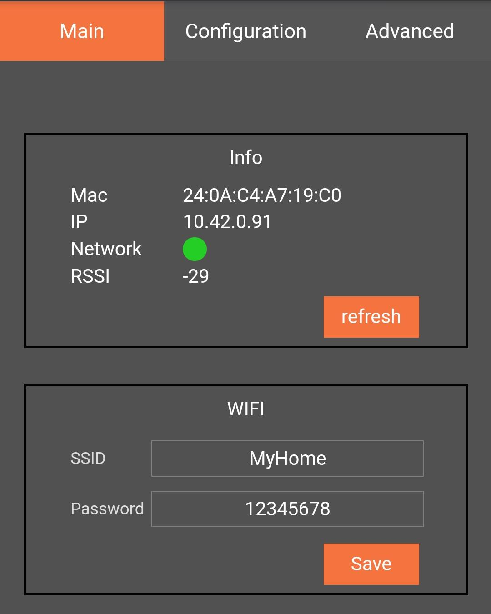
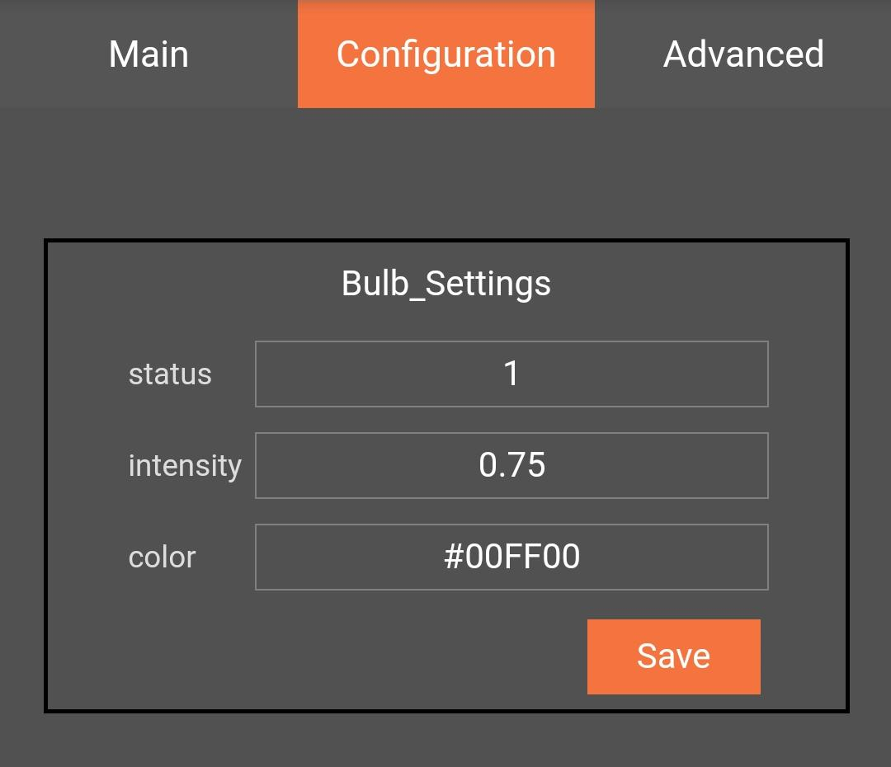

# Iot-Pitcher

Thank you for using IotPitcher, this documentation is only for your project. If you cannot find what you are looking for, visit [IotPitcher](https://www.iotpitcher.com)

## Table of contents

- [Iot-Pitcher](#iot-pitcher)
  - [Table of contents](#table-of-contents)
  - [How to use this example project](#how-to-use-this-example-project)  
  - [Building](#building)
    - [Copying the source](#copying-the-source)
    - [Changing Arduino-ESP32 platform file](#changing-arduino-esp32-platform-file)
  - [Troubleshooting , Technical support & Feedback](#troubleshooting--technical-support--feedback)


## How to use this example project

This project includes 5 different examples and only created for the project configuration. Just add any other Arduino library and examples will be available on your Arduino-IDE.

If you have not used archive (.a) file as a library before, [see](#building). 

In order to get started see examples/IotPitcher_Getting_Started, other examples are provided to show you how to get used to IotPitcher-API. After uploading the sketch 

- Open your wifi and scan
- Connect to`IoT Bulb Access Point` with password `12345678` 
- Open your browser and type `192.168.4.1` on your URL
- You should see the main page of IotPitcher

You can set the WiFi ssid and password for your router and see it will connect when it finds.

Below pictures are the output of examples/IotPitcher_Getting_Started. 

<table class="mytable">
  <th>
    <tr>
      <td></td>
      <td></td>
    </tr>
</table>


     


## Building
This library is created for your project. It is similar to Arduino libraries but does not contain source files, instead we provide precompiled archive file. In order to compile archive files please follow the next steps.

### Copying the source
To use the library only need to copy this folder and put under your `Arduino/libraries` folder. You can also use zip file to import, follow the steps `Arduino-IDE -> Sketch -> Include Library -> Add .ZIP library ` 

### Changing Arduino-ESP32 platform file
In order to compile archive files platform.txt file under `Arduino15` or `arduino15` folder.
Under the following comment in platform.txt `# These can be overridden in platform.local.txt` copy and paste the next line `compiler.libraries.ldflags=`

For example it should look like this
```cmake
# These can be overridden in platform.local.txt
compiler.c.extra_flags= -Os
compiler.c.elf.extra_flags=
compiler.S.extra_flags=
compiler.cpp.extra_flags= -Os
compiler.ar.extra_flags=
compiler.objcopy.eep.extra_flags=
compiler.elf2hex.extra_flags=
compiler.libraries.ldflags=
```

Also change `recipe.c.combine.pattern=` line, add `{compiler.libraries.ldflags}` between `{object_files}` and `"{archive_file_path}"`

For example
```cmake
recipe.c.combine.pattern="{compiler.path}{compiler.c.elf.cmd}" {compiler.c.elf.flags} {compiler.c.elf.extra_flags} -Wl,--start-group {object_files} {compiler.libraries.ldflags} "{archive_file_path}" {compiler.c.elf.libs} -Wl,--end-group -Wl,-EL -o "{build.path}/{build.project_name}.elf"
```
If you do not changed the original `platform.txt` before, you can use the provided `platform.txt` in this folder. It is designed to compile archive files.


## Troubleshooting , Technical support & Feedback
Please visit [IotPitcher](https://www.iotpitcher.com) or mail us hello@iotpitcher.com
