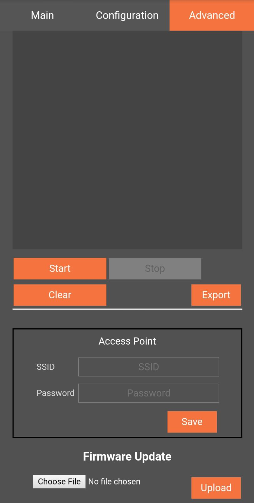

# Iot-Pitcher

Thank you for using IotPitcher, this documentation is only for your project. If you cannot find what you are looking for, visit [IotPitcher](https://www.iotpitcher.com)




## Table of contents

- [Iot-Pitcher](#iot-pitcher)
  - [Table of contents](#table-of-contents)
  - [Building](#building)
    - [Copying the source](#copying-the-source)
    - [Changing Arduino-ESP32 platform file](#changing-arduino-esp32-platform-file)
  - [Troubleshooting , Technical support & Feedback](#troubleshooting--technical-support--feedback)


## Building
This library is created for your project. It is similar to Arduino libraries but does not contain source files, instead we provide precompiled archive file. In order to compile archive files please follow the next steps.

### Copying the source
To use the library only need to copy this folder and put under your `Arduino/libraries` folder. You can also use zip file to import, follow the steps `Arduino-IDE -> Sketch -> Include Library -> Add .ZIP library ` 

### Changing Arduino-ESP32 platform file
In order to compile archive files platform.txt file under `Arduino15` or `arduino15` folder.
Under the following comment in platform.txt `# These can be overridden in platform.local.txt` copy and paste the next line `compiler.libraries.ldflags=`

For example it should look like this
```cmake
# These can be overridden in platform.local.txt
compiler.c.extra_flags= -Os
compiler.c.elf.extra_flags=
compiler.S.extra_flags=
compiler.cpp.extra_flags= -Os
compiler.ar.extra_flags=
compiler.objcopy.eep.extra_flags=
compiler.elf2hex.extra_flags=
compiler.libraries.ldflags=
```

Also change `recipe.c.combine.pattern=` line, add `{compiler.libraries.ldflags}` between `{object_files}` and `"{archive_file_path}"`

For example
```cmake
recipe.c.combine.pattern="{compiler.path}{compiler.c.elf.cmd}" {compiler.c.elf.flags} {compiler.c.elf.extra_flags} -Wl,--start-group {object_files} {compiler.libraries.ldflags} "{archive_file_path}" {compiler.c.elf.libs} -Wl,--end-group -Wl,-EL -o "{build.path}/{build.project_name}.elf"
```
If you do not changed the original `platform.txt` before, you can use the provided `platform.txt` in this folder. It is designed to compile archive files.


## Troubleshooting , Technical support & Feedback
Please visit [IotPitcher](https://www.iotpitcher.com) or mail us hello@iotpitcher.com